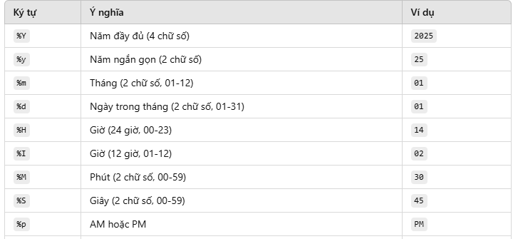

- format lấy 6 chữ số sau dấu "," là:   `print(f'{sum:.6f}')`

- python có thể xử lý được số nguyên lớn

- hàm ord() dùng để chuyển 1 ký tự sang mã ascii

- i.isdigit() để kiểm tra chuỗi "i" có phải là số không

- set() có union() là hợp vào intersection() là giao (hoăc dùng & với |)

- .items(): chuyển 1 cái dict để có thể duyệt for được

- strip() giống trim() bên java

- // là chia lấy phần nguyên

- sort trong class: arr.sort(key=lambda e: (-e.avg, e.id))

- datetime với hàm strptime(date, format) (có thuộc tính days và seconds)

